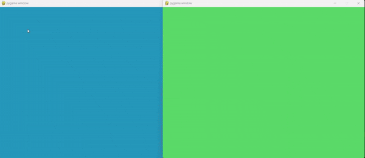

# Pygamdraw

Realtime collaborative drawing application where multiple people can draw together on a shared canvas.

## Demo

[](url)

## Controls

- Left mouse button to draw
- Mouse wheel/Scroll to adjust brush size
- Space to reset canvas
- Left Shift to set a random background colour

## Setup

- Clone the repo or download source files
- Install required dependencies

```bash
pip install pygame
```

## Usage

- Change the server address/ports if running on multiple devices, or leave as is for running via localhost

- Start the server:

```bash
python server.py
```

- Start the clients:

```bash
python client.py
```
